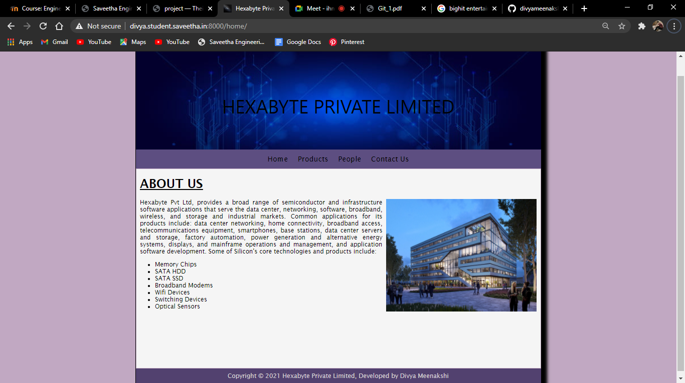
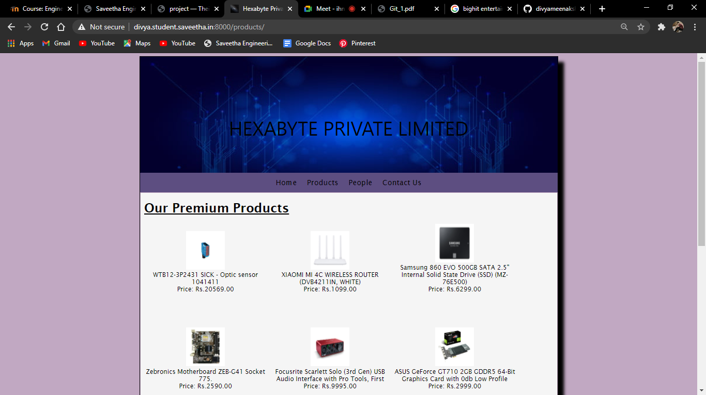
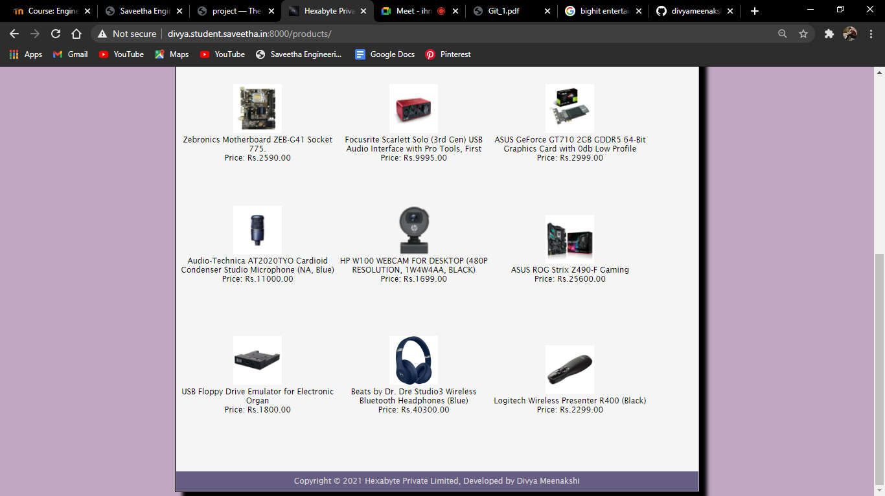
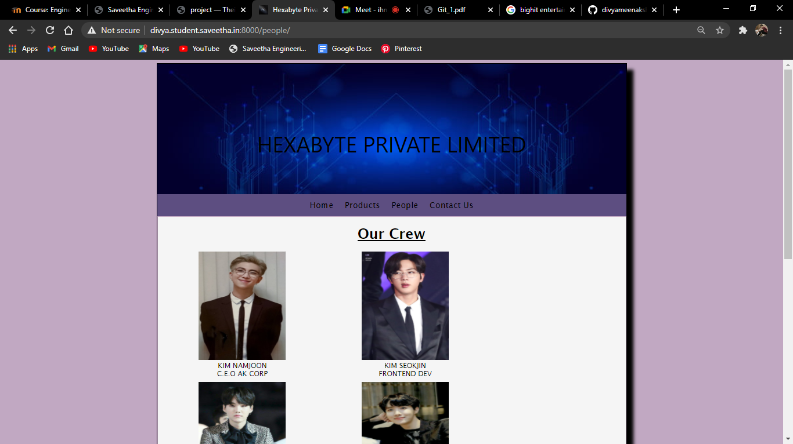
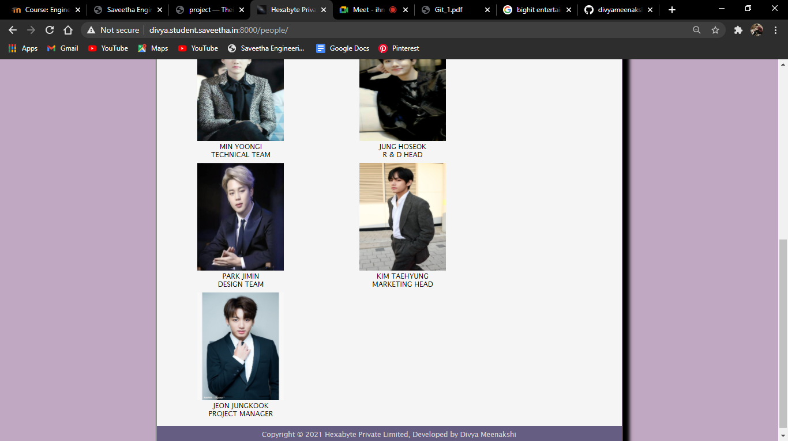
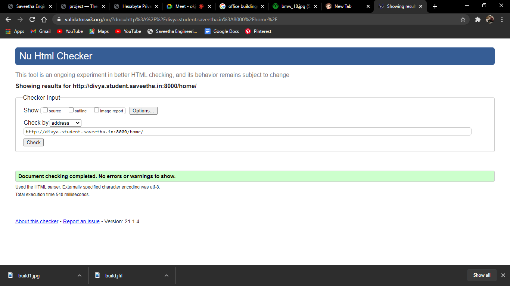
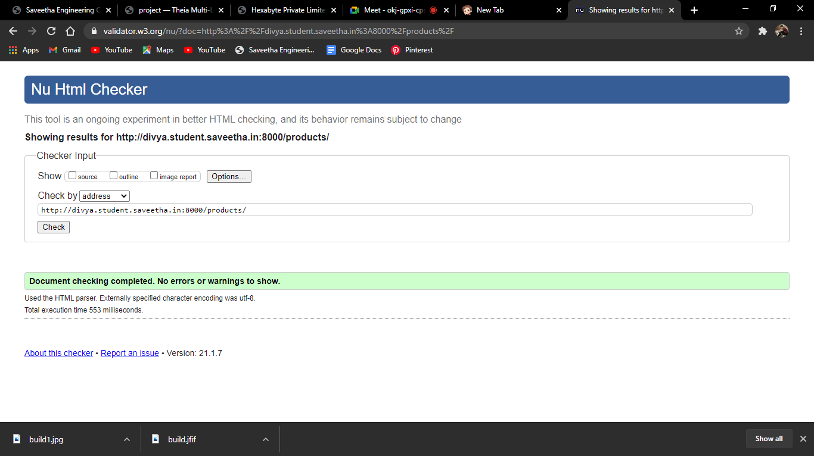
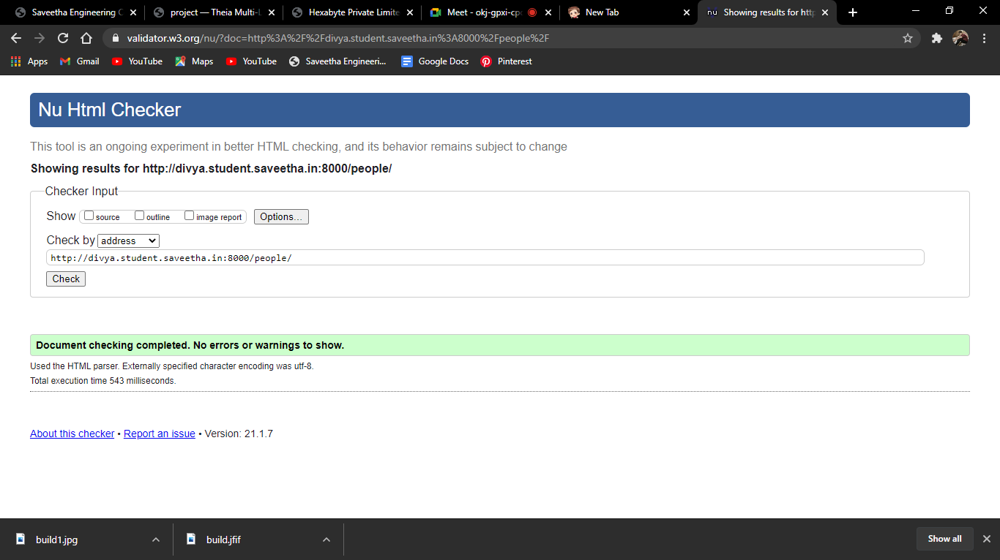

# Web Design for a Manufacturing Company
## AIM: 
To design a static website for a chip manufacturing company.

## DESIGN STEPS:
### Step 1: 
Requirement collection.
### Step 2:
Creating the layout using HTML and CSS.
### Step 3:
Updating the sample content.
### Step 4:
Choose the appropriate style and color scheme.
### Step 5:
Validate the layout in various browsers.
### Step 6:
Validate the HTML code.
### Step 6:
Publish the website in the given URL.

## PROGRAM:

### base.html
```

<!DOCTYPE html>
<html lang="en">

<head>
    <title>Hexabyte Private Limited</title>
    <link rel="stylesheet" href="">
    <link rel = "icon" href ="" type = "image/x-icon"> 
              
</head>

<body>
    <div class="container">
    <div class="banner">
       HEXABYTE PRIVATE LIMITED
    </div>
    <div class="menu">
        <div class="menuitem"><a href="/home">Home</a></div> 
        <div class="menuitem"><a href="/products">Products</a></div> 
        <div class="menuitem"><a href="/people">People</a></div>
        <div class="menuitem"><a href="/contact">Contact Us</a></div> 
    </div><div class="content">
        
    
    </div>
    <div class="footer">
        Copyright © 2021 Hexabyte Private Limited, Developed by Divya Meenakshi
    </div>
    </div>
</body>

</html>
```

### home.html
```



    <div class="homecontent">    
        <h1><u>ABOUT US</u></h1>
        
    
        <div class="contenttext">
            Hexabyte Pvt Ltd, provides a broad range of semiconductor and infrastructure software applications that serve the data center, networking, software, broadband, wireless, and storage and industrial markets. Common applications for its products include: data center networking, home connectivity, broadband access, telecommunications equipment, smartphones, base stations, data center servers and storage, factory automation, power generation and alternative energy systems, displays, and mainframe operations and management, and application software development. Some of Silicon's core technologies and products include:
            <ul>
                <li>Memory Chips</li>
                <li>SATA HDD</li>
                <li>SATA SSD </li>
                <li>Broadband Modems</li>
                <li>Wifi Devices</li>
                <li>Switching Devices</li>
                <li>Optical Sensors</li>
            </ul> 
        </div>
    </div>

```
### products.html
```



    <div class="productcontent">    
    <h1><u>Our Premium Products</u></h1>
    <div class="productitems">
        <div class="productitem"> 
            <div class="itemimage">
            
            </div>
            <div class="itemname">WTB12-3P2431 SICK - Optic sensor 1041411</div>
            <div class="itemprice">Price: Rs.20569.00 </div>
        </div>
        <div class="productitem"> 
            <div class="itemimage">
            
            </div>
            <div class="itemname">XIAOMI MI 4C WIRELESS ROUTER (DVB4211IN, WHITE)</div>
            <div class="itemprice">Price: Rs.1099.00 </div>
        </div>
        <div class="productitem"> 
            <div class="itemimage">
            
            </div>
            <div class="itemname">Samsung 860 EVO 500GB SATA 2.5" Internal Solid State Drive (SSD) (MZ-76E500)</div>
            <div class="itemprice">Price: Rs.6299.00 </div>
        </div>
        <div class="productitem"> 
            <div class="itemimage">
            
            </div>
            <div class="itemname">Zebronics Motherboard ZEB-G41 Socket 775.</div>
            <div class="itemprice">Price: Rs.2590.00 </div>
        </div>
        <div class="productitem"> 
            <div class="itemimage">
            
            </div>
            <div class="itemname">Focusrite Scarlett Solo (3rd Gen) USB Audio Interface with Pro Tools, First</div>
            <div class="itemprice">Price: Rs.9995.00 </div>
        </div>
        <div class="productitem"> 
            <div class="itemimage">
            
            </div>
            <div class="itemname">ASUS GeForce GT710 2GB GDDR5 64-Bit Graphics Card with 0db Low Profile</div>
            <div class="itemprice">Price: Rs.2999.00 </div>
        </div>
        <div class="productitem"> 
            <div class="itemimage">
            
            </div>
            <div class="itemname">Audio-Technica AT2020TYO Cardioid Condenser Studio Microphone (NA, Blue)</div>
            <div class="itemprice">Price: Rs.11000.00 </div>
        </div>
        <div class="productitem"> 
            <div class="itemimage">
            
            </div>
            <div class="itemname">HP W100 WEBCAM FOR DESKTOP (480P RESOLUTION, 1W4W4AA, BLACK)</div>
            <div class="itemprice">Price: Rs.1699.00 </div>
        </div>
        <div class="productitem"> 
            <div class="itemimage">
            
            </div>
            <div class="itemname">ASUS ROG Strix Z490-F Gaming</div>
            <div class="itemprice">Price: Rs.25600.00 </div>
        </div>
        <div class="productitem"> 
            <div class="itemimage">
            
            </div>
            <div class="itemname">USB Floppy Drive Emulator for Electronic Organ</div>
            <div class="itemprice">Price: Rs.1800.00 </div>
        </div>
        <div class="productitem"> 
            <div class="itemimage">
            
            </div>
            <div class="itemname">Beats by Dr. Dre Studio3 Wireless Bluetooth Headphones (Blue)</div>
            <div class="itemprice">Price: Rs.40300.00 </div>
        </div>
        <div class="productitem"> 
            <div class="itemimage">
            
            </div>
            <div class="itemname">Logitech Wireless Presenter R400 (Black)</div>
            <div class="itemprice">Price: Rs.2299.00 </div>
        </div>
    </div>
    </div>

```
### people.html
```




    <div class="peoplecontent">
    <h1><u>Our Crew</u></h1>
        <div class="crewmember">
            <div class="memberimage">
                
            </div>
            <div class="membername">KIM NAMJOON</div>
            <div class="designation">C.E.O AK CORP</div>
        </div>
        <div class="crewmember">
            <div class="memberimage">
                
            </div>
            <div class="membername">KIM SEOKJIN</div>
            <div class="designation">FRONTEND DEV</div>
        </div>
        <div class="crewmember">
            <div class="memberimage">
                
            </div>
            <div class="membername">MIN YOONGI</div>
            <div class="designation">TECHNICAL TEAM</div>
        </div>
        <div class="crewmember">
            <div class="memberimage">
                
            </div>
            <div class="membername">JUNG HOSEOK</div>
            <div class="designation"> R & D HEAD </div>
        </div>
        <div class="crewmember">
            <div class="memberimage">
                
            </div>
            <div class="membername">PARK JIMIN</div>
            <div class="designation"> DESIGN TEAM </div>
        </div>
        <div class="crewmember">
            <div class="memberimage">
                
            </div>
            <div class="membername">KIM TAEHYUNG</div>
            <div class="designation"> MARKETING HEAD </div>
        </div>
        <div class="crewmember">
            <div class="memberimage">
                
            </div>
            <div class="membername">JEON JUNGKOOK</div>
            <div class="designation"> PROJECT MANAGER </div>
        </div>
    </div>    
 
```
### contact.html
```



    <div class="content">

        <p class="free">

        </p>
        <div class="contain">
            <div class="image">
                
            </div>
            <div class="text">
            <h2><u>CONTACT NO:</u><br>
                +822 34440105</h2>
            </div>
        </div>
        <div class="contain">
            <div class="image">
            </div>
            <div class="text">
                <h2><u>EMAIL:</u><br>
                hexabytepvt.ltd@gmail.com</h2>
            </div>
            <div class="text">
                <h2><u>ADDRESS:</u><br>
                42 Teheran-ro 108-gil, Daechi-dong,<br>
                Gangnam-gu, Seoul, South Korea
                </h2>
            </div>
        </div>
    </div>


```


## OUTPUT:











## CODE VALIDATION REPORT:







## RESULT:
Thus a website is designed for the chip manufacturing company and is hosted in the URL http://divya.student.saveetha.in:8000/. HTML code is validated.